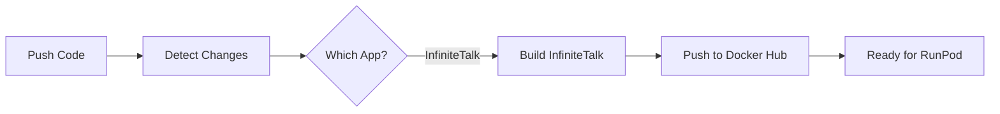

# RunPod Serverless Applications

本仓库包含多个用于 RunPod Serverless 部署的 AI 应用项目。

## 📦 项目列表

### 1. [InfiniteTalk - AI 口型同步视频生成](./infinitetalk)
基于 InfiniteTalk 的 AI 口型同步视频生成服务。

**特性：**
- 图片转视频（I2V）和视频转视频（V2V）
- 支持单人和多人场景
- 基于 ComfyUI 工作流
- 多种输入方式（Path/URL/Base64）

**状态：** ✅ 生产就绪

## 🚀 快速开始

### 前置要求

- [Bun](https://bun.sh) - 项目使用 Bun 作为脚本运行时
- Docker 和 Docker Hub 账号
- RunPod 账号和 API Key
- GitHub 账号（用于 CI/CD）

### 本地开发

#### 安装依赖

```bash
bun install
```

#### 使用 Bun 脚本

```bash
# 检查项目配置
bun run check

# 构建 Docker 镜像
bun run docker:build          # 构建所有应用

# 推送到 Docker Hub
bun run docker:push           # 推送所有应用

# 运行集成测试
bun test                      # 测试所有 endpoints
bun run test:infinitetalk     # 只测试 InfiniteTalk
```

#### 构建和测试 Docker 镜像

```bash
# InfiniteTalk
cd infinitetalk
docker build -t infinitetalk-runpod:test .
```

#### 本地运行（需要 GPU）

```bash
# InfiniteTalk
docker run --gpus all -p 8000:8000 infinitetalk-runpod:test
```

## 🔧 GitHub Actions 自动部署

本仓库使用 GitHub Actions 自动构建和部署 Docker 镜像。

### 设置 GitHub Secrets

在仓库的 **Settings → Secrets and variables → Actions** 中添加：

| Secret | 描述 |
|--------|------|
| `DOCKER_USERNAME` | Docker Hub 用户名 |
| `DOCKER_PASSWORD` | Docker Hub 密码或访问令牌 |

### 部署触发方式

#### 1. 自动触发（推荐）

当你推送代码到 `main` 分支时，GitHub Actions 会自动检测变更：

- 修改 `infinitetalk/**` → 只部署 InfiniteTalk

```bash
git add .
git commit -m "Update InfiniteTalk handler"
git push origin main
```

#### 2. 手动触发

在 GitHub 仓库页面：
1. 点击 **Actions** 标签
2. 选择 **Deploy RunPod Applications** workflow
3. 点击 **Run workflow**
4. 选择要部署的应用：
   - `all` - 部署所有应用
   - `infinitetalk` - 只部署 InfiniteTalk

### 部署流程



## 📝 部署到 RunPod

### 方法 1: 使用 Docker Hub 镜像（推荐）

1. **创建 Template**
   - 访问 [RunPod Templates](https://www.runpod.io/console/serverless/user/templates)
   - 点击 **New Template**
   - 设置 Docker 镜像：
     - InfiniteTalk: `your-username/infinitetalk-runpod:latest`

2. **配置 Template**
   - Container Disk: 50GB+ (InfiniteTalk)
   - Environment Variables: 根据需要配置
   - Network Volume: 可选，用于持久化模型权重

3. **创建 Endpoint**
   - 选择创建的 Template
   - 配置 GPU 类型和数量
   - 设置 Worker 数量：
     - Active Workers: 0（按需启动）
     - Max Workers: 3-5
   - 启用 FlashBoot（推荐）

4. **测试 Endpoint**
   ```bash
   curl -X POST https://api.runpod.ai/v2/YOUR_ENDPOINT_ID/run \
     -H "Content-Type: application/json" \
     -H "Authorization: Bearer YOUR_API_KEY" \
     -d '{"input": {...}}'
   ```

### 方法 2: 使用 RunPod CLI

```bash
# 安装 runpodctl
brew install runpod/runpodctl/runpodctl  # macOS
# 或
wget -qO- cli.runpod.net | sudo bash     # Linux

# 配置 API Key
runpodctl config --apiKey=YOUR_API_KEY

# 部署（从项目目录）
cd infinitetalk
runpodctl project deploy
```

## 🔑 环境变量

### InfiniteTalk
```env
SERVER_ADDRESS=127.0.0.1  # ComfyUI 服务地址（默认值）
```

## 📊 项目结构

```
runpod-apps/
├── .github/
│   └── workflows/
│       └── deploy-runpod-apps.yml  # CI/CD workflow
├── scripts/                        # Bun 脚本
│   ├── check.ts                   # 检查项目配置
│   ├── docker-build.ts            # 构建 Docker 镜像
│   └── docker-push.ts             # 推送镜像到 Docker Hub
├── infinitetalk/                   # InfiniteTalk 项目
│   ├── Dockerfile
│   ├── handler.py
│   ├── entrypoint.sh
│   ├── I2V_*.json                 # 工作流配置
│   ├── V2V_*.json
│   └── README.md
├── package.json                    # Bun 项目配置
├── bun.lock                        # Bun 依赖锁定文件
├── .env                            # 本地环境变量（不提交）
├── .gitignore
└── README.md                       # 本文件
```

## 🛠️ 开发指南

### Bun 脚本开发

本项目使用 Bun 作为脚本运行时。所有脚本位于 `scripts/` 目录：

```typescript
#!/usr/bin/env bun

import { $ } from "bun";

// 运行 shell 命令
await $`docker build -t myapp .`;

// 文件操作
const file = Bun.file("path/to/file");
const content = await file.text();
```

详见 [scripts/README.md](./scripts/README.md)

### 添加新应用

1. 创建新目录：`mkdir my-new-app`
2. 添加必要文件：
   - `Dockerfile`
   - `handler.py`（实现 RunPod handler）
   - `requirements.txt`
   - `README.md`
3. 更新 `.github/workflows/deploy-runpod-apps.yml`
4. 测试本地构建和部署

### 测试 Handler

```python
# test_handler.py
import runpod

job = {
    "input": {
        # 你的测试输入
    }
}

result = handler(job)
print(result)
```

## 📚 相关资源

- [RunPod Documentation](https://docs.runpod.io/)
- [RunPod Serverless](https://docs.runpod.io/serverless/overview)
- [Docker Hub](https://hub.docker.com/)
- [GitHub Actions](https://docs.github.com/en/actions)

## 🐛 故障排除

### Docker 构建失败
- 检查 Dockerfile 语法
- 验证基础镜像是否可用
- 查看构建日志中的错误信息

### GitHub Actions 失败
- 验证 Secrets 是否正确设置
- 检查 Docker Hub 凭证
- 查看 Actions 日志详细信息

### RunPod 部署问题
- 确认镜像已成功推送到 Docker Hub
- 检查 RunPod Template 配置
- 验证 GPU 资源可用性

## 📄 许可证

各项目遵循其原始许可证：
- InfiniteTalk: Apache 2.0

## 🤝 贡献

欢迎提交 Issue 和 Pull Request！

1. Fork 本仓库
2. 创建特性分支：`git checkout -b feature/amazing-feature`
3. 提交变更：`git commit -m 'Add amazing feature'`
4. 推送分支：`git push origin feature/amazing-feature`
5. 创建 Pull Request
